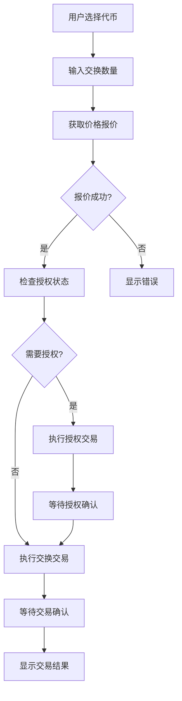
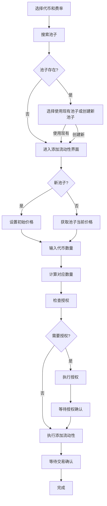
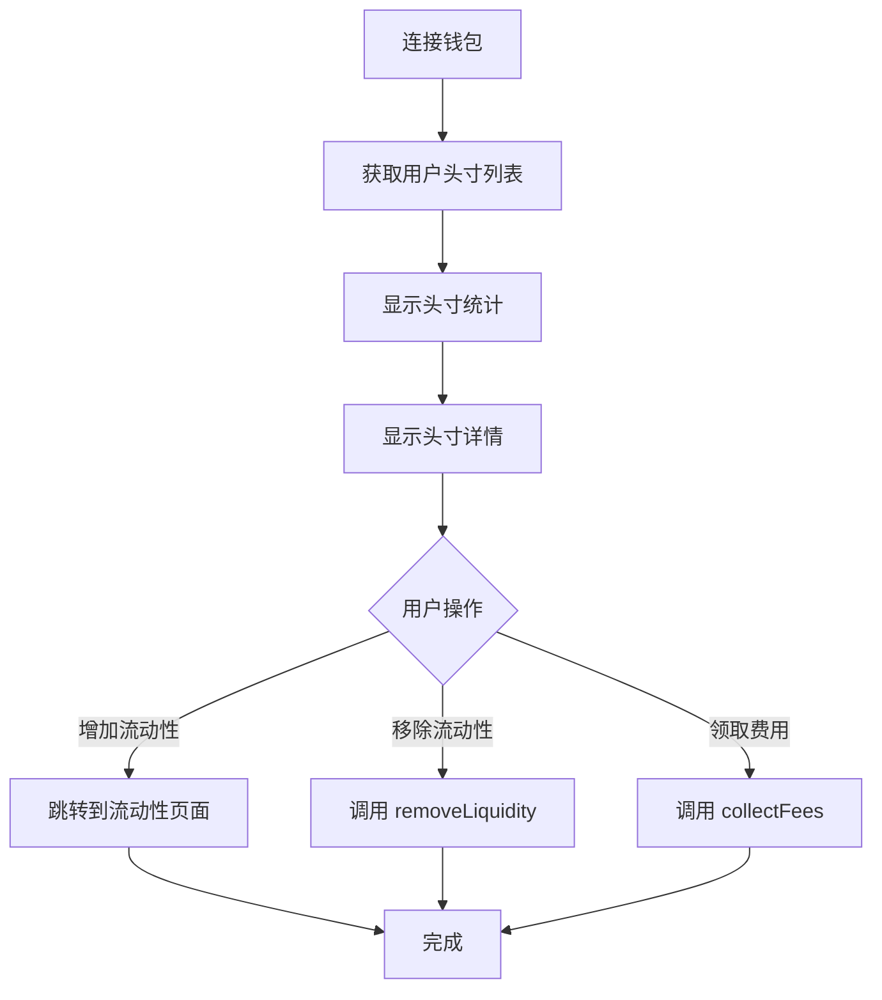

# MetaNodeSwap DEX 前端业务教学文档

## 📚 目录

1. [项目概述](#项目概述)
2. [核心功能模块](#核心功能模块)
3. [业务流程详解](#业务流程详解)
4. [技术架构](#技术架构)
5. [API 接口说明](#api-接口说明)
6. [开发指南](#开发指南)

---

## 项目概述

MetaNodeSwap 是一个基于 Uniswap V3 设计的去中心化交易所（DEX）前端应用，运行在 Sepolia 测试网络上。该平台提供了完整的代币交换、流动性管理和头寸管理功能。

### 主要特性

- 🔄 **代币交换**: 支持任意 ERC20 代币之间的交换
- 💧 **流动性池管理**: 创建池子、添加/移除流动性
- 📊 **头寸管理**: 查看和管理用户的流动性头寸
- 🎨 **现代化 UI**: 基于 Tailwind CSS 的响应式设计
- 🔗 **Web3 集成**: 支持 MetaMask 等钱包连接
- 📈 **数据可视化**: 实时显示池子统计和交易记录
- 🎯 **NFT 功能**: NFT 收藏展示和 API 测试
- 🔍 **区块链扫描器**: 查看链上交易和池子数据

### 技术栈

- **框架**: Next.js 15 (App Router)
- **样式**: Tailwind CSS 4
- **Web3**: Wagmi + Viem + RainbowKit
- **状态管理**: React Query (TanStack Query)
- **语言**: TypeScript
- **包管理器**: Bun

---

## 核心功能模块

### 1. 代币交换 (Swap)

**路径**: `/` (主页)

**功能描述**:
- 用户可以在两个代币之间进行交换
- 实时获取价格报价
- 支持滑点设置
- 自动检查代币授权状态

**核心组件**: `SwapInterface`

**主要功能点**:

1. **代币选择**
   - 从预定义代币列表中选择
   - 支持快速切换输入/输出代币

2. **价格报价**
   - 实时调用后端 API 获取最优价格
   - 显示价格影响和预估输出数量
   - 支持模拟报价（当池子不存在时）

3. **代币授权**
   - 自动检测是否需要授权
   - 一键授权功能
   - 授权后自动刷新状态

4. **交易执行**
   - 调用 SwapRouter 合约执行交换
   - 实时显示交易状态（等待确认、确认中、成功）
   - 显示交易哈希

**业务流程**:

```
1. 用户选择输入代币和输出代币
2. 输入交换数量
3. 系统自动获取价格报价（防抖 500ms）
4. 检查代币授权状态
5. 如需授权，先执行授权交易
6. 用户确认交换
7. 执行交换交易
8. 等待交易确认
9. 显示交易结果
```

**关键代码位置**:
- 组件: `src/components/swap/SwapInterface.tsx`
- Hook: `src/hooks/useSwap.ts`
- API: `src/app/api/quote/route.ts`

---

### 2. 流动性池 (Pools)

**路径**: `/pools`

**功能描述**:
- 查看所有可用的流动性池
- 显示池子的关键指标（TVL、24h 交易量、费率等）
- 点击池子查看详细信息

**核心组件**: `PoolsPage`

**显示信息**:

1. **池子基本信息**
   - 交易对（Token0/Token1）
   - 费率等级（0.05%, 0.3%, 1%）
   - 池子地址

2. **池子统计数据**
   - TVL (总锁定价值)
   - 24h 交易量
   - APR (年化收益率)
   - 流动性数量

3. **操作按钮**
   - "Add Pool" - 跳转到添加流动性页面

**数据来源**:
- 后端 API: `/api/pools`
- 从数据库获取池子列表和统计数据

**关键代码位置**:
- 页面: `src/app/pools/page.tsx`
- API: `src/app/api/pools/route.ts`

---

### 3. 池子详情 (Pool Detail)

**路径**: `/pools/[address]`

**功能描述**:
- 查看特定池子的详细信息
- 显示池子的历史交易记录
- 显示价格图表和流动性分布

**核心组件**: `PoolDetailClient`

**显示内容**:

1. **池子概览**
   - 交易对信息
   - 当前价格
   - TVL 和交易量
   - 费率信息

2. **交易历史**
   - 最近的交换记录
   - 交易哈希、时间、数量等

3. **操作选项**
   - 添加流动性
   - 移除流动性
   - 查看头寸

**关键代码位置**:
- 页面: `src/app/pools/[address]/page.tsx`
- 客户端组件: `src/app/pools/[address]/PoolDetailClient.tsx`
- API: `src/app/api/pools/[address]/route.ts`

---

### 4. 流动性管理 (Liquidity)

**路径**: `/liquidity`

**功能描述**:
- 创建新的流动性池
- 向现有池子添加流动性
- 管理流动性头寸

**核心组件**: `LiquidityManager`

**业务流程**:

#### 步骤 1: 选择池子参数

用户需要选择:
- Token0 地址
- Token1 地址
- 费率等级 (500, 3000, 10000)
- 链 ID (当前为 Sepolia: 11155111)

#### 步骤 2: 搜索池子

系统会调用 `/api/pools/check` 检查池子是否存在:

- **如果池子存在**:
  - 显示池子地址和索引
  - 提供两个选项:
    1. 使用现有池子
    2. 创建新池子

- **如果池子不存在**:
  - 提示将创建新池子
  - 进入添加流动性界面

#### 步骤 3: 添加流动性

**对于新池子**:
1. 设置初始价格比率 (Token0:Token1)
2. 输入两个代币的数量
3. 系统根据价格比率自动计算对应数量
4. 检查代币授权
5. 执行创建池子并添加流动性的交易

**对于已存在池子**:
1. 输入代币数量
2. 系统根据池子当前价格计算对应数量
3. 检查代币授权
4. 执行添加流动性交易

**关键功能**:

1. **价格计算**
   - 新池子: 使用用户设置的初始价格比率
   - 已存在池子: 调用 `/api/pools/price` 获取当前价格

2. **代币授权**
   - 自动检查两个代币的授权状态
   - 分别授权（如果需要）

3. **交易执行**
   - 新池子: 调用 `PoolManager.createAndInitializePoolIfNecessary`
   - 已存在池子: 调用 `PositionManager.mint`

**关键代码位置**:
- 组件: `src/components/pools/LiquidityManager.tsx`
- Hook: `src/hooks/useCreatePool.ts`
- API: 
  - `src/app/api/pools/check/route.ts`
  - `src/app/api/pools/price/route.ts`

---

### 5. 头寸管理 (Positions)

**路径**: `/positions`

**功能描述**:
- 查看用户的所有流动性头寸
- 显示头寸的收益和费用
- 管理头寸（增加/移除流动性、领取费用）

**核心组件**: `PositionsPage`

**显示信息**:

1. **统计概览**
   - 活跃头寸数量
   - 总价值 (USD)
   - 未领取费用
   - 总收益率

2. **头寸列表**
   每个头寸显示:
   - 交易对和费率
   - 价格范围（范围内/范围外状态）
   - 流动性价值
   - 未领取费用（Token0 + Token1）
   - Tick 范围
   - 操作按钮:
     - 增加流动性
     - 移除流动性
     - 领取费用

**数据来源**:
- Hook: `usePositions`
- 从后端 API 获取用户的头寸数据

**关键代码位置**:
- 页面: `src/app/positions/page.tsx`
- Hook: `src/hooks/usePositions.ts`

---

### 6. 区块链扫描器 (Scanner)

**路径**: `/scanner`

**功能描述**:
- 查看链上交易记录
- 查看池子统计信息
- 查看平台整体数据

**核心组件**: `ScannerPage`

**功能模块**:

1. **统计概览**
   - 总交易数
   - 流动性池数
   - 独立交易者数
   - 今日交易量
   - 今日交易次数
   - 流动性变更次数

2. **交易记录**
   - 显示所有交换交易
   - 包含交易哈希、时间、交易对、数量等
   - 支持分页浏览

3. **流动性池列表**
   - 显示所有池子的统计信息
   - 包含交易次数、总交易量等

**数据来源**:
- API: `/api/scanner`
- 从数据库查询链上事件数据

**关键代码位置**:
- 页面: `src/app/scanner/page.tsx`
- API: `src/app/api/scanner/route.ts`

---

### 7. 代币铸造 (Release)

**路径**: `/release`

**功能描述**:
- 部署 ERC20 代币合约
- 自动铸造初始代币
- 快速添加到钱包
- 跳转到添加流动性

**核心组件**: `ReleasePage`

**业务流程**:

1. **部署合约**
   - 输入代币名称 (Name)
   - 输入代币符号 (Symbol)
   - 点击部署按钮
   - 等待交易确认

2. **完成部署**
   - 显示合约地址
   - 提示已自动铸造 100,000 代币
   - 提供"添加到钱包"按钮
   - 提供"去添加流动性"按钮

**关键功能**:
- 使用 `walletClient.deployContract` 部署合约
- 合约部署后自动铸造初始代币
- 支持添加到 MetaMask 等钱包

**关键代码位置**:
- 页面: `src/app/release/page.tsx`
- 合约配置: `src/lib/release-contract.ts`

---

## 业务流程详解

### 代币交换流程



**详细步骤**:

1. **代币选择**
   - 用户从下拉列表选择输入代币和输出代币
   - 可以点击交换按钮快速切换

2. **数量输入**
   - 用户输入要交换的数量
   - 可以点击"最大"按钮使用全部余额
   - 系统自动验证输入格式

3. **价格报价**
   - 输入后 500ms 防抖，自动调用 `/api/quote`
   - 显示预估输出数量和价格比率
   - 如果报价失败，显示错误信息

4. **授权检查**
   - 检查输入代币对 SwapRouter 的授权额度
   - 如果授权不足，显示授权按钮

5. **授权交易**
   - 调用 ERC20 的 `approve` 函数
   - 授权额度为输入数量
   - 等待交易确认后刷新授权状态

6. **执行交换**
   - 调用 SwapRouter 的 `exactInput` 函数
   - 传入代币地址、数量、滑点等参数
   - 等待交易确认

7. **结果展示**
   - 显示交易哈希
   - 提供链接到区块浏览器
   - 刷新代币余额

---

### 添加流动性流程



**详细步骤**:

1. **选择参数**
   - 输入或选择 Token0 和 Token1 地址
   - 选择费率等级（0.05%, 0.3%, 1%）
   - 确认链 ID

2. **搜索池子**
   - 调用 `/api/pools/check` 检查池子
   - 传入 token0, token1, fee 参数
   - 返回池子是否存在、地址、索引等信息

3. **处理搜索结果**
   - **池子存在**: 显示池子信息，提供使用或创建选项
   - **池子不存在**: 直接进入创建流程

4. **价格设置/获取**
   - **新池子**: 用户设置初始价格比率（如 1 MNA = 2 MNB）
   - **已存在池子**: 调用 `/api/pools/price` 获取当前价格

5. **数量输入和计算**
   - 用户输入一个代币的数量
   - 系统根据价格自动计算另一个代币的数量
   - 支持点击"最大"使用全部余额

6. **授权检查**
   - 检查两个代币对 PositionManager 的授权
   - 如果授权不足，分别显示授权按钮

7. **执行交易**
   - **新池子**: 调用 `PoolManager.createAndInitializePoolIfNecessary`
     - 传入代币地址、费率、价格范围、初始价格
   - **已存在池子**: 调用 `PositionManager.mint`
     - 传入池子索引、代币数量、接收地址等

8. **完成**
   - 等待交易确认
   - 显示交易结果
   - 可选：刷新池子状态

---

### 头寸管理流程



**头寸信息包含**:

- 池子地址和交易对
- 费率等级
- 价格范围（Tick Lower/Upper）
- 当前价格是否在范围内
- 流动性数量
- 未领取的费用（Token0 和 Token1）
- 头寸价值（USD）

---

## 技术架构

### 项目结构

```
dex-frontend/
├── src/
│   ├── app/                    # Next.js App Router 页面
│   │   ├── page.tsx           # 主页（交换界面）
│   │   ├── pools/             # 池子相关页面
│   │   ├── positions/         # 头寸管理页面
│   │   ├── liquidity/        # 流动性管理页面
│   │   ├── nfts/              # NFT 页面
│   │   ├── scanner/           # 扫描器页面
│   │   ├── release/           # 代币铸造页面
│   │   └── api/               # API 路由
│   ├── components/            # React 组件
│   │   ├── layout/            # 布局组件
│   │   ├── swap/              # 交换组件
│   │   ├── pools/             # 池子组件
│   │   ├── nft/               # NFT 组件
│   │   └── providers/         # Context Providers
│   ├── hooks/                 # 自定义 Hooks
│   │   ├── useSwap.ts         # 交换逻辑
│   │   ├── usePools.ts        # 池子数据
│   │   ├── usePositions.ts    # 头寸数据
│   │   └── ...
│   └── lib/                   # 工具函数和配置
│       ├── constants.ts       # 合约地址和常量
│       ├── contracts.ts       # 合约 ABI 配置
│       ├── utils.ts           # 工具函数
│       └── wagmi.ts           # Wagmi 配置
```

### 核心 Hooks

#### useSwap

**功能**: 处理代币交换逻辑

**主要方法**:
- `getQuote(params)`: 获取价格报价
- `approveToken(tokenAddress, amount)`: 授权代币
- `executeSwap(params)`: 执行交换
- `useTokenAllowance(tokenAddress)`: 检查授权状态

**使用示例**:
```typescript
const {
  executeSwap,
  approveToken,
  getQuote,
  useTokenAllowance,
  isPending,
  isConfirming,
  isConfirmed,
  hash,
} = useSwap()
```

#### usePools

**功能**: 获取池子列表数据

**返回数据**:
- `pools`: 池子列表
- `loading`: 加载状态
- `error`: 错误信息
- `totalStats`: 统计数据

#### usePositions

**功能**: 获取用户的流动性头寸

**返回数据**:
- `positions`: 头寸列表
- `stats`: 统计信息（总价值、未领取费用等）
- `loading`: 加载状态
- `error`: 错误信息

### Web3 配置

**Wagmi 配置** (`src/lib/wagmi.ts`):
- 配置 Sepolia 测试网
- 设置 RPC 节点
- 配置 RainbowKit 钱包连接

**合约地址** (`src/lib/constants.ts`):
- PoolManager: `0xddC12b3F9F7C91C79DA7433D8d212FB78d609f7B`
- PositionManager: `0xbe766Bf20eFfe431829C5d5a2744865974A0B610`
- SwapRouter: `0xD2c220143F5784b3bD84ae12747d97C8A36CeCB2`

**测试代币**:
- MNA: `0x4798388e3adE569570Df626040F07DF71135C48E`
- MNB: `0x5A4eA3a013D42Cfd1B1609d19f6eA998EeE06D30`
- MNC: `0x86B5df6FF459854ca91318274E47F4eEE245CF28`
- MND: `0x7af86B1034AC4C925Ef5C3F637D1092310d83F03`

---

## API 接口说明

### 交换相关

#### GET/POST `/api/quote`

**功能**: 获取代币交换价格报价

**请求参数**:
```json
{
  "tokenIn": "0x...",
  "tokenOut": "0x...",
  "amountIn": "1000000000000000000",
  "indexPath": [0],
  "sqrtPriceLimitX96": "0"
}
```

**响应**:
```json
{
  "amountOut": "2000000000000000000",
  "priceImpact": "0.5",
  "simulated": false
}
```

#### POST `/api/allowance`

**功能**: 检查代币授权额度

**请求参数**:
```json
{
  "token": "0x...",
  "owner": "0x...",
  "spender": "0x..."
}
```

**响应**:
```json
{
  "success": true,
  "allowance": "1000000000000000000"
}
```

### 池子相关

#### GET `/api/pools`

**功能**: 获取池子列表

**查询参数**:
- `page`: 页码（默认 1）
- `limit`: 每页数量（默认 10）

**响应**:
```json
{
  "success": true,
  "data": [
    {
      "pool": "0x...",
      "token0": "0x...",
      "token1": "0x...",
      "token0Symbol": "MNA",
      "token1Symbol": "MNB",
      "fee": 3000,
      "feePercent": "0.30%",
      "liquidity": "1000000",
      "tvl": "$50000",
      "tvlUSD": 50000,
      "volume24h": "$10000",
      "feesUSD": 30
    }
  ],
  "pagination": {
    "total": 10,
    "page": 1,
    "limit": 10
  }
}
```

#### POST `/api/pools/check`

**功能**: 检查池子是否存在

**请求参数**:
```json
{
  "token0": "0x...",
  "token1": "0x...",
  "fee": 3000
}
```

**响应**:
```json
{
  "success": true,
  "exists": true,
  "poolAddress": "0x...",
  "poolIndex": 0
}
```

#### POST `/api/pools/price`

**功能**: 获取池子价格并计算对应数量

**请求参数**:
```json
{
  "poolAddress": "0x...",
  "inputToken": "0x...",
  "inputAmount": "100"
}
```

**响应**:
```json
{
  "success": true,
  "outputAmount": "200"
}
```

#### GET `/api/pools/[address]`

**功能**: 获取池子详细信息

**响应**:
```json
{
  "success": true,
  "data": {
    "pool": "0x...",
    "token0": "0x...",
    "token1": "0x...",
    "fee": 3000,
    "liquidity": "1000000",
    "sqrtPriceX96": "...",
    "tick": 0,
    "swaps": [...]
  }
}
```

### 扫描器相关

#### GET `/api/scanner`

**功能**: 获取扫描器数据

**查询参数**:
- `action`: `stats` | `swaps` | `pools`
- `page`: 页码（swaps 时使用）
- `limit`: 每页数量（swaps 时使用）

**响应示例 (stats)**:
```json
{
  "success": true,
  "data": {
    "total_swaps": 1000,
    "total_pools": 10,
    "total_liquidity_changes": 500,
    "unique_traders": 200,
    "daily_volume": "1000000000000000000000",
    "daily_trades": 50
  }
}
```

### NFT 相关

#### GET `/api/nfts`

**功能**: 获取地址的 NFT 列表

**查询参数**:
- `address`: 钱包地址

**响应**:
```json
{
  "success": true,
  "data": [
    {
      "tokenId": "1",
      "contractAddress": "0x...",
      "metadata": {...}
    }
  ]
}
```

---

## 开发指南

### 环境设置

1. **安装依赖**
```bash
bun install
```

2. **配置环境变量**
创建 `.env.local` 文件:
```env
NEXT_PUBLIC_CHAIN_ID=11155111
NEXT_PUBLIC_RPC_URL=https://sepolia.infura.io/v3/...
```

3. **启动开发服务器**
```bash
bun dev
```

### 添加新功能

#### 1. 添加新页面

在 `src/app/` 下创建新目录和 `page.tsx`:

```typescript
export default function NewPage() {
  return <div>新页面</div>
}
```

#### 2. 创建新组件

在 `src/components/` 下创建组件文件:

```typescript
'use client'

export default function NewComponent() {
  return <div>新组件</div>
}
```

#### 3. 创建自定义 Hook

在 `src/hooks/` 下创建 Hook 文件:

```typescript
import { useState } from 'react'

export function useNewHook() {
  const [data, setData] = useState(null)
  
  return { data }
}
```

#### 4. 添加 API 路由

在 `src/app/api/` 下创建新目录和 `route.ts`:

```typescript
import { NextResponse } from 'next/server'

export async function GET() {
  return NextResponse.json({ success: true })
}
```

### 最佳实践

1. **组件设计**
   - 使用 `'use client'` 标记客户端组件
   - 保持组件单一职责
   - 使用 TypeScript 类型定义

2. **状态管理**
   - 使用 React Query 管理服务器状态
   - 使用 useState/useReducer 管理本地状态
   - 避免不必要的全局状态

3. **错误处理**
   - 所有 API 调用都要有错误处理
   - 显示用户友好的错误信息
   - 记录错误日志

4. **性能优化**
   - 使用防抖处理频繁的 API 调用
   - 使用 React.memo 优化组件渲染
   - 懒加载非关键组件

5. **用户体验**
   - 显示加载状态
   - 提供交易状态反馈
   - 使用 Toast 通知用户

### 常见问题

#### 1. 交易失败

**可能原因**:
- Gas 不足
- 滑点过大
- 授权不足
- 池子流动性不足

**解决方法**:
- 检查钱包余额
- 调整滑点设置
- 确认授权状态
- 检查池子状态

#### 2. 价格报价失败

**可能原因**:
- 池子不存在
- 路径无效
- 数量过大

**解决方法**:
- 检查代币地址是否正确
- 确认池子已创建
- 减少交换数量

#### 3. 授权不生效

**可能原因**:
- 交易未确认
- 授权额度不足

**解决方法**:
- 等待交易确认
- 检查授权额度
- 重新授权

---

## 总结

MetaNodeSwap DEX 前端提供了完整的去中心化交易所功能，包括：

1. ✅ **代币交换**: 支持任意代币交换，实时价格报价
2. ✅ **流动性管理**: 创建池子、添加/移除流动性
3. ✅ **头寸管理**: 查看和管理流动性头寸
4. ✅ **数据可视化**: 池子统计、交易记录等
5. ✅ **NFT 功能**: NFT 收藏和 API 测试
6. ✅ **区块链扫描**: 链上数据查询和分析
7. ✅ **代币铸造**: 一键部署 ERC20 代币

该平台基于现代化的技术栈构建，提供了良好的用户体验和开发体验。通过本文档，开发者可以快速理解业务逻辑，进行功能扩展和优化。

---

**文档版本**: 1.0  
**最后更新**: 2024年  
**维护者**: MetaNodeSwap 开发团队

